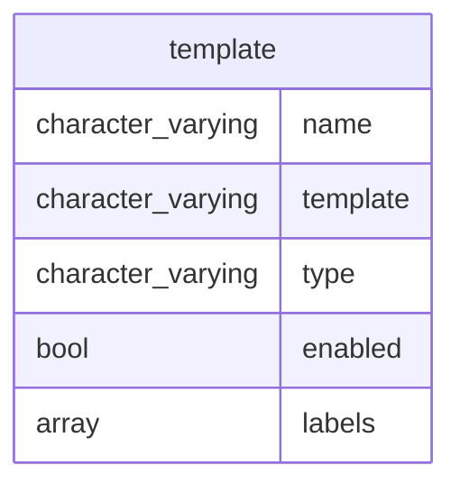

# STemplateAPI

Simple ..., String ... , Super?
Liquid strings templates by API.

## Model



<<<<<<< HEAD
<<<<<<< HEAD
=======
>>>>>>> bcf22ab (Test factory for templates and update controller test)
## Examples

<!-- TODO: add it -->
```txt
That's my secret {{ hero.name }}: I'm always angry.
```

```json
{
  "hero": {
    "name": "Captain"
  }
}
```

## Cleaning code

```shell
direnv allow
mix setup
mix deps.update --all
mix test

mix format # format code
mix credo # like rubocop
mix coveralls.html # code coverage
mix deps.audit # libraries vulnerabilities check
mix sobelow # security static code check
mix dialyzer # static analysis tool for Erlang
mix docs # gen doc

mix phx.server
open http://localhost:4000/api/templates
```

## Routes

```shell
# simplified routes
mix phx.routes | grep '/api' | awk '{print $2 " " $3}' | sed '/.*Controller/d'

# seed some data
mix run priv/repo/seeds.exs
```
<<<<<<< HEAD
=======

>>>>>>> 987819c (Generated files)
=======
>>>>>>> bcf22ab (Test factory for templates and update controller test)
