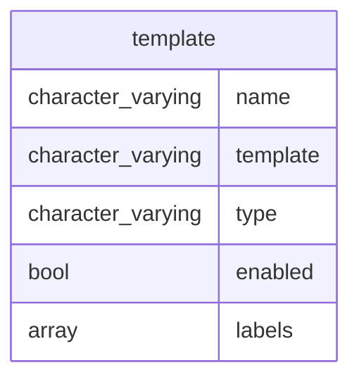

# STemplateAPI

Simple ..., String ... , Super?
Liquid strings templates by API.

## Model

```mermaid
erDiagram

    template {
        character_varying name
        character_varying template
        character_varying type
        bool enabled
        array labels
    }
```

